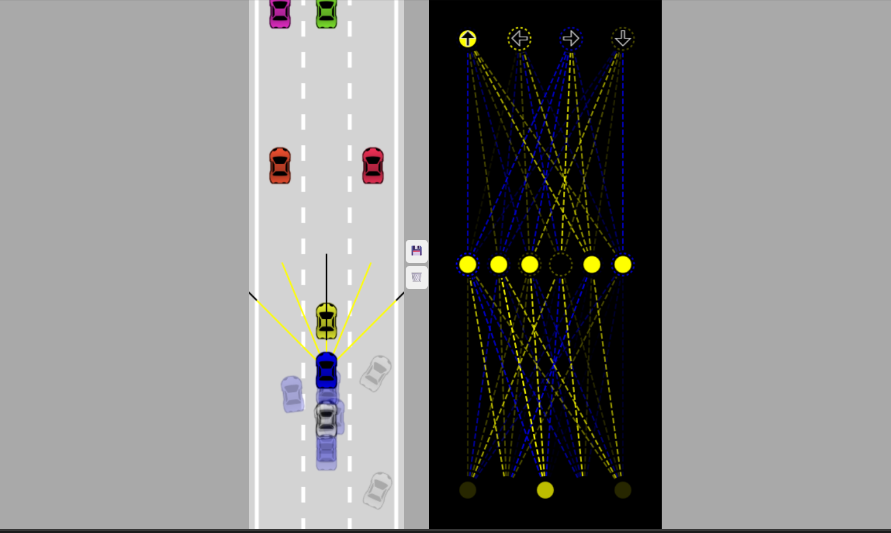

# Self-Driving Car Simulation

A functional self-driving car simulation built from scratch using pure JavaScript, without any external libraries. The project implements a neural network and a genetic algorithm to train cars to navigate through traffic and stay within road boundaries.



##  Project Structure

The project is organized into several modular JavaScript files, each handling a specific aspect of the simulation:

- **`index.html`**: The main entry point that sets up the canvases and scripts.
- **`main.js`**: Core logic for the simulation loop, car generation, and environment setup.
- **`car.js`**: Defines the `Car` class, handling physics, movement, and drawing.
- **`road.js`**: Manages the road structure, lanes, and borders.
- **`sensor.js`**: Implements the ray-casting sensor system for obstacle detection.
- **`network.js`**: The brain of the car , a custom-built neural network with multi-layer support and mutation logic.
- **`visualizer.js`**: Provides real-time visualization of the neural network's architecture and activations.
- **`controls.js`**: Handles both keyboard input (for manual control/dummy cars) and AI-driven inputs.
- **`utils.js`**: Contains mathematical utility functions (LERP, intersections, collision detection).
- **`styles.css`**: Basic styling for the simulation interface.

##  Features

- **Custom Neural Network**: A fully functional neural network implemented from scratch.
- **Advanced Genetic Algorithm**: Uses neuroevolution with both **Mutation** and **Crossover** (Genetic Recombination) to train cars. The top two performers are used as parents for each new generation.
- **Ray-Casting Sensors**: Each AI car has sensors that detect the distance to road borders and other traffic.
- **Traffic Simulation**: Dummy cars with basic AI to act as obstacles.
- **Real-Time Visualization**: A live view of the neural network's weights and biases as the car makes decisions.
- **Collision Detection**: Sophisticated polygon-based collision detection for accurate simulation.
- **No Libraries**: Built entirely with Vanilla JavaScript and HTML5 Canvas.

## How It Works

### 1. Perception (Sensors)
The car perceives its environment using a `Sensor` system. It casts rays in various directions and calculates the distance to the nearest obstacle (road border or traffic). This data is then normalized and fed into the neural network.

### 2. Brain (Neural Network)
The `NeuralNetwork` consists of an input layer (taking sensor data), hidden layers, and an output layer. The output layer determines the car's actions: forward, backward, left, or right.

### 3. Evolution (Learning)
The simulation generates a population of cars (e.g., 200) simultaneously using a Genetic Algorithm:
- **Selection**: The car that travels the furthest (lowest `y` coordinate) is identified as the `bestCar`.
- **Crossover**: When you save your progress, the top two performers' brains are stored. New generations are then created by recombining (crossing over) the weights and biases of these two parents.
- **Mutation**: To ensure the population doesn't get stuck in local optima, random mutations are applied to the child brains, slightly tweaking their neural connections.
- **Persistence**: Clicking the **Save (💾)** button stores the two best brains in `localStorage`, allowing the simulation to continue evolving across browser refreshes.

### 4. Rendering
The simulation uses two canvases:
- **Car Canvas**: Displays the road, traffic, and the population of cars.
- **Network Canvas**: Visualizes the neural network of the current best car, showing which neurons are firing.

##  Getting Started

1. Clone the repository:
   ```bash
   git clone https://github.com/mibienpanjoe/Self-Driving-Car.git
   ```
2. Open `index.html` in any modern web browser.
3. Use the **💾** button to save the current best brain and the **🗑️** button to reset training.
